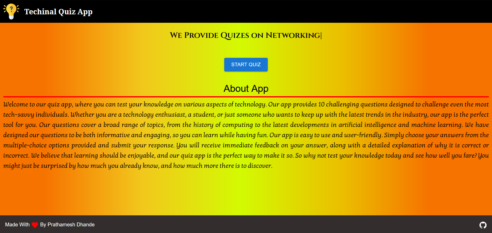
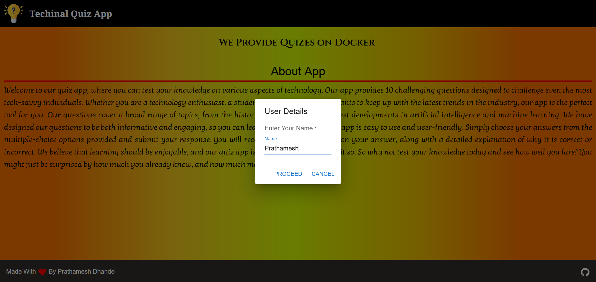
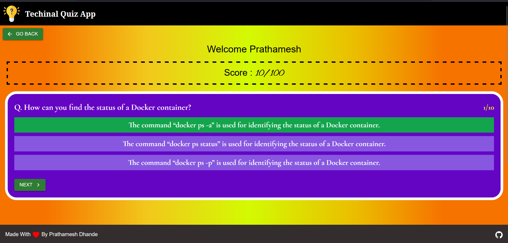
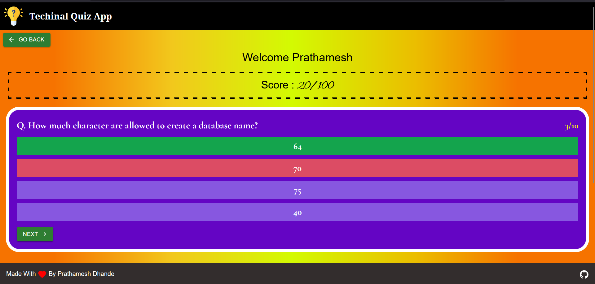

# Quiz Application using React js

## Demo : https://quiz-app-in-react.vercel.app/

This is the First Project for React Series in Web Development Tutorial.

This is a quiz app built using React with Material UI, MDBBootstrap, React-Bootstrap, and Redux. The app uses a quiz API to generate 10 questions per quiz. Each correct answer gives the user a score of 10.

## ScreenShots :
1. HomePage of the App.

2. Asking User Name.

3. Quiz Page.

4. Quiz Page when Wrong Option Selected.

## Installation :

To use the app, follow these steps:

1. Clone the repository to your local machine.
2. Install the necessary dependencies by running npm install in your terminal.
3. Create a .env file in the root directory and include the API key for the quiz API in the following format: REACT_APP_QUIZ_API=your_api_key_here.
   Usage
4. To run the app, use the command npm start in your terminal. The app will open in your browser at http://localhost:3000.

## Usage :

The user will be prompted to enter their name before starting the quiz. The quiz consists of 10 multiple-choice questions. The user will receive immediate feedback on their answers, and their score will be displayed at the end of the quiz.

## Dependencies

- React
- Material UI
- MDBBootstrap
- React-Bootstrap
- Redux
- Axios

## Contributing

If you would like to contribute to this project, please create a pull request. All contributions are welcome.

## License

This project is licensed under the MIT License. See the LICENSE file for more information.

## Images Taken From :

- <a href="https://www.flaticon.com/free-icons/quiz" title="quiz icons">Quiz icons created by Freepik - Flaticon</a>

## Author : Prathamesh Dhande
